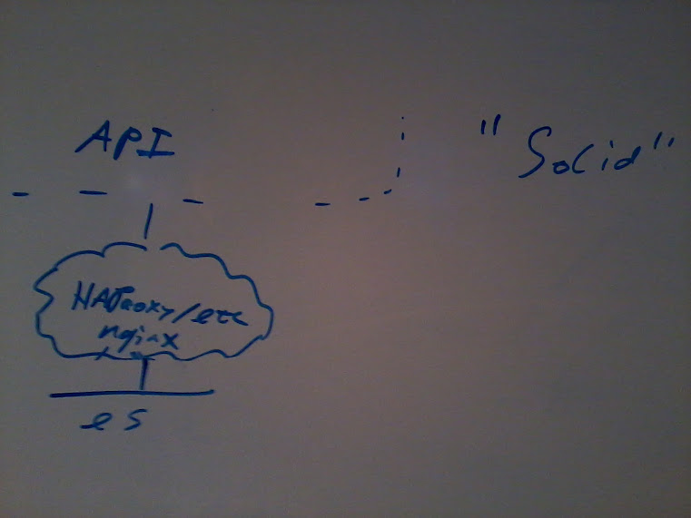
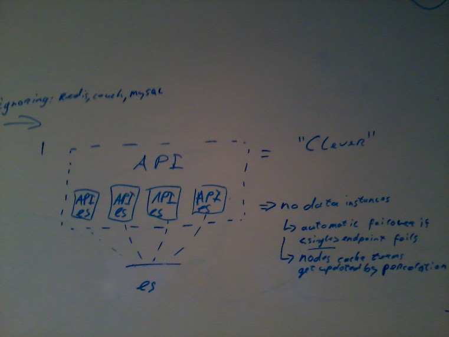
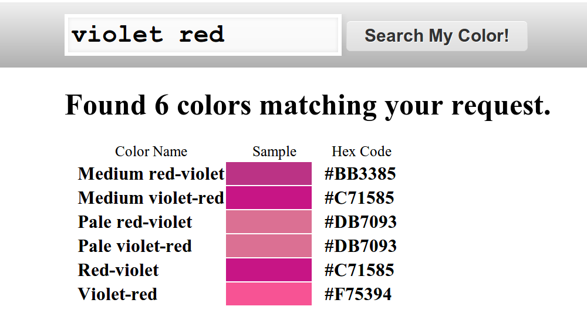
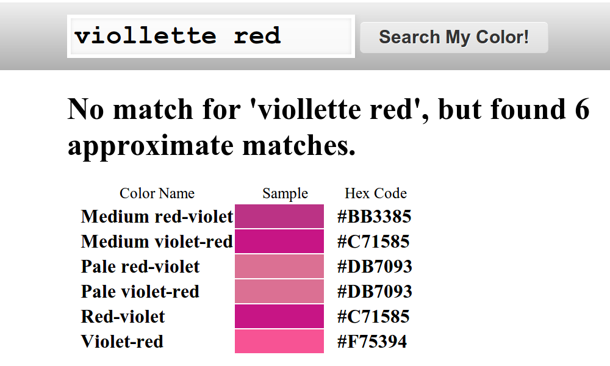
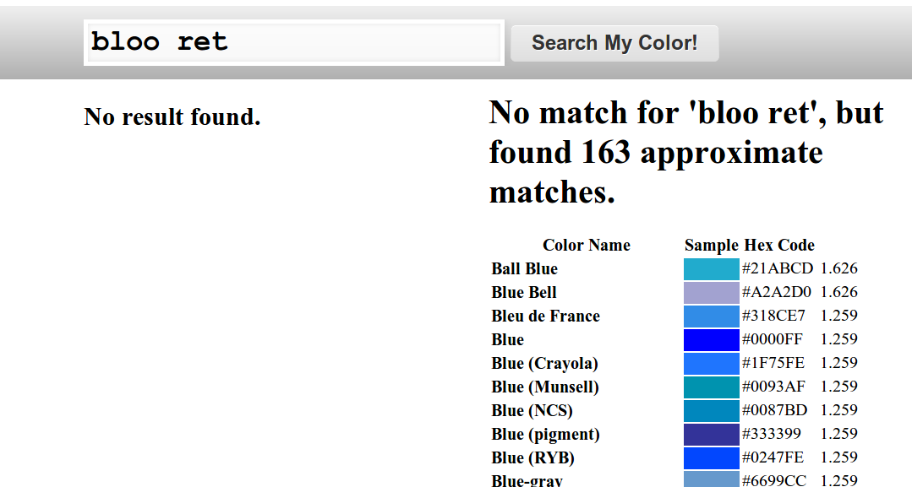

# graduation-slides

!SLIDE

# Twan Wolthof

## Graduation
### Zuyd University
### 2013-03-01

!SLIDE left

### Schedule

+ VideofyMe
+ What issue was I to solve
+ Previous situation
+ My results
+ Things I am not satisfied with

optional: extras

!SLIDE

!SLIDE

!SLIDE

# Why?

!SLIDE left reveal

### Videofyme has

+ an increasing growth of users
+ an increasing growth of videos
+ an (until recently) crippled database

!SLIDE

# Search
## for videos

!SLIDE left reveal

### How was this done before?

1. Transform the query into a regex
2. Tokenize several columns of the video
3. Apply the regex on each tokenized string
4. Collect the results

!SLIDE

# Happy?

!SLIDE

## No!

### &nbsp;

!SLIDE

## No!

### Slow as a snail.

!SLIDE left

## PROS

+ Easy to implement
+ Fuzzy regexes are better than  
    SQL's `LIKE "%mytoken"`

!SLIDE left

##CONS

+ Not scalable
+ Not flexible
+ Hard to maintain
+ No unicode support (lack of ICU)

!SLIDE
# &nbsp;
Two kinds of search

!SLIDE

### Non-fulltext search

Tagging

Classification

!NOTES
Tagging: associating keywords to a document
Cliassification: categories and subcategories

!SLIDE

### Full-text search
Searching documents in a database, using free text.

!SLIDE

#Elasticsearch

!SLIDE left

### What is Elasticsearch?
+ Lucene based full text search
+ NoSQL key-value store
+ Schema free, document oriented
+ Out of the box scaling and failover
+ Not just for search: analytics

and more!

!SLIDE left

### So Elasticsearch gives
+ Powerfull full text search  
    with an expressive query language  
     (near real time: < 1 second)
+ Distributed by design
+ Fault tolerant
+ Easy sharding
+ Start small, scale massively!

!SLIDE

# Cool!
### But is it actually true?

!SLIDE

# Yes
### but it still requires
### common sense

!SLIDE
!SLIDE
###So…

!SLIDE
### I read and studied

!SLIDE left reveal list-style-none

+ followed mailing lists
+ collaborated on IRC
+ implemented a very  
    basic search system  
    to get familiar with  
    VideofyMe's API

!SLIDE

### designed some things

!SLIDE reveal list-style-none

### Experienced a keynote
### about Elasticsearch

!SLIDE

### I revisited my
### infrastructure designs

!SLIDE

!SLIDE

!SLIDE
# And put them
# to the test!

!SLIDE
### Cluster load balancing using
| HAProxy | Nginx | Elasticsearch
:-----------|:-------:|:-------:|:-------:|
CPU         | 30% | 34% | 34%
Memory      | 13% | 15% | 12% to 18%
Requests/s  | &nbsp;&nbsp;&nbsp;18k/s (σ: 335)&nbsp;&nbsp;&nbsp; | &nbsp;&nbsp;&nbsp;15k/s (σ: 281)&nbsp;&nbsp;&nbsp; | &nbsp;&nbsp;&nbsp; 17k/s (σ: 130) &nbsp;&nbsp;&nbsp;
Latency     | 83ms (σ: 46) | 93ms (σ: 41) | 78ms (σ: 34)
Introduces a single point of failure? | yes | yes | no
Ease of configuration | 30min. | 30min. | 5min.

!SLIDE
### Choice based on tests
### and my musings

&nbsp;

| Elasticsearch
:-----------|:-------:|
CPU         | 34%
Memory      | 12% to 18%
Requests/s  | &nbsp;&nbsp;&nbsp; 17k/s (σ: 130) &nbsp;&nbsp;&nbsp;
Latency     | 78ms (σ: 34)
Single point of failure | no
Easy to configure | yes

!SLIDE
### designed and implemented
### query abstractions
(used to get data back)

!SLIDE
### wired this together
### in the existing codebase

!SLIDE
### while migrating from
### their old SQL-regex solution

!SLIDE
### and let my peers finetune
### relevancy of documents

!SLIDE timer
#[Time?](#slide-57)
### the time is now

Wow you are fast!

!SLIDE

###Example of analyzers

Searching for colors

Autocompletion

!SLIDE left

### What happens when...
+ The ideal user types "violet red"
+ The average user types "viollette red"
+ The random user types "bloo ret"

!SLIDE

!SLIDE

!SLIDE

!SLIDE

!SLIDE left reveal

### Autocomplete analyzer

1. Input
    + "Édith Piaf"
1. Standard tokenizer
    + ["Édith", "Piaf"]
2. Lowercase token filter
    + ["édith", "Piaf"]
3. Ascii-folding token filter (using ICU)
    + ["eidth", "piaf"]
4. edge-ngrams token filter
    + ["e","ed","edi","edit","edith",  
    "p","pi","pia","piaf"]
    
    
    
    

!SLIDE left reveal
### Things I am not satisfied with

&nbsp;

+ Lack of formal documents  
    *Advised against by Patrick*
+ Lack of full deployment  
    *Prevented by AWS*

!SLIDE left

References:

+ [infinity and beyond](http://www.elasticsearch.org/videos/2012/10/26/to-infinity-and-beyond.htm)  
By Clintom Gormley
+ The Elasticsearch book  
    the official book;  
    as yet unpublished material  
    from Elasticsearch.com
